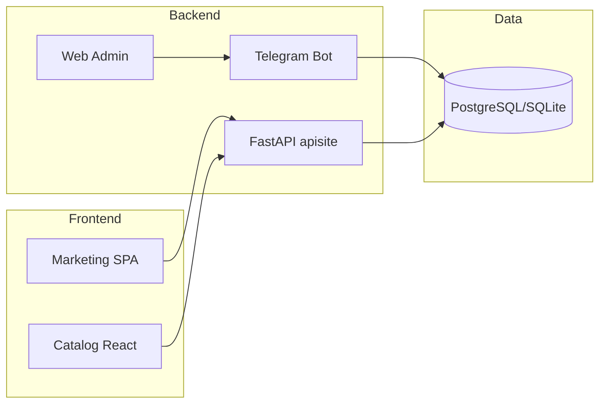

# План презентации проекта ЭлектроМонтаж / grgroup.kz

Справочный документ для подготовки презентации: содержание слайдов, использованные технологии и цветовая палитра в тоне сайта. HEX и таблицы можно копировать в PowerPoint, Google Презентации или Figma.

---

## 1. О чём проект

**ЭлектроМонтаж** (электромонтаж.kz / grgroup.kz) — цифровой продукт компании: маркетинговый сайт, каталог оборудования, Telegram-бот для тендеров и веб-админка. Один монорепозиторий, несколько сервисов.

**Целевые слайды:**

- **Титульный:** название проекта, слоган («Энергия Ваших Проектов» / «Профессиональные электромонтажные и слаботочные работы»).
- **Проблема/решение:** один вход для клиентов (сайт + каталог + бот), единый стиль и стек.

---

## 2. Что использовалось (содержимое для слайдов)

### Фронтенд (основной сайт, порт 5173)

- **Vite** + **React 18** + **TypeScript**
- **React Router** — маршрутизация (главная, услуги, цены, контакты, калькулятор)
- **CSS Modules** — стили без Tailwind, дизайн-токены в `src/shared/styles/variables.css`
- **React Hook Form** — формы и валидация
- **react-helmet-async** — SEO (title, description)
- **framer-motion** — анимации
- **Three.js** + **@react-three/fiber** + **@react-three/drei** — 3D/декоративная графика (при наличии)
- **ESLint** + **Prettier**

### Фронтенд каталога (порт 8001 / 3000)

- **Vite** + **React** в `tenderbot/apisite/react`
- **react-router-dom**, **framer-motion**, **three**, **react-window**

### Бэкенд

- **Python:** **FastAPI** (API и раздача статики каталога), **aiogram** (Telegram-бот), **uvicorn**
- **БД:** **SQLAlchemy**, **asyncpg** / **aiosqlite**, **Alembic**
- **Конфиг:** **pydantic** / **pydantic-settings**, **python-dotenv**
- **Веб-админка:** FastAPI + **Jinja2** (порт 8000)

### Каталог/парсинг (apisite)

- **requests**, **BeautifulSoup**, **lxml**, **httpx**, **openpyxl** (Excel), **ddgs**, **selenium** при необходимости

### Инфраструктура

- **PM2** (ecosystem.config.cjs) для запуска всех сервисов; скрипты в `README.md` (`npm run dev:all` и др.).

---

## 3. Структура проекта (слайд-схема)

**Сервисы и порты:** основной сайт **5173**, каталог+API **8001**, веб-админка TenderBot **8000**.

**Ключевые фичи для слайдов:** главная (о компании, услуги, партнёры, цифровая экосистема, калькулятор, контакты), страницы «Проекты», «Умные системы», «Цифровая экосистема», «Работа», калькулятор видеонаблюдения/домофонии, каталог товаров и checkout, Telegram-бот (регистрация, тендеры, отклики, поддержка), Mini App, веб-админка.

Схему архитектуры можно нарисовать по диаграмме ниже (Mermaid) или перенести в draw.io / Figma:



---

## 3.1. Полный функционал сайта (маркетинг SPA + каталог)

### Маркетинговый сайт (порт 5173)

**Маршруты и страницы:**

| Маршрут | Страница | Описание |
|---------|----------|----------|
| `/` | Главная | О компании, услуги, партнёры, цифровая экосистема, калькулятор видеонаблюдения/домофонии, контакты |
| `/services` | Услуги | Секция «Наши услуги» с карточками и ценами |
| `/contacts` | Контакты | Контакты (телефон, email, адрес, режим работы) и форма заявки |
| `/projects` | Проекты | Реализованные проекты G&R Group (видеонаблюдение, безопасность, электромонтаж) |
| `/smart-systems` | Умные системы | Оборудование Akuvox: сенсорные панели, умный дом; бегущая строка и модалка товара |
| `/digital-ecosystem` | Цифровая экосистема дома | IP-домофония и видеонаблюдение, коммерческое предложение |
| `/work` | Работа с G&R Group | Описание мини-приложения для подрядчиков: контракты, заявки, вакансии |
| `/calculator` | Калькулятор | Калькулятор видеонаблюдения и домофонии (этажи, подъезды, камеры → смета) |
| `/catalog`, `/catalog/*` | Редирект | Перенаправление на каталог (хост каталога, например 8001 или grgroup.kz/catalog) |

**Секции на главной:** О компании (About), Услуги (Services), Партнёры (Partners), Цифровая экосистема (DigitalEcosystem), Калькулятор видеонаблюдения (CctvCalculatorSection), Контакты (ContactSection). Hero и ИИ-помощник в коде закомментированы.

**Формы:**

- **Форма заявки (контакты):** имя*, телефон*, email, тип проекта (select), сообщение*. Отправка через API (mock или реальный бэкенд), toast «Успешно отправлено».
- **Форма «Точный расчёт» (из калькулятора):** данные калькулятора + контакты, отправка заявки.

**Виджеты и фичи:**

- Калькулятор видеонаблюдения/домофонии: параметры объекта (этажи, подъезды, камеры у входа) → расчёт оборудования (камеры, кабель, NVR, коммутатор, HDD, домофонные панели) и ориентировочная смета в тенге; кнопка «Точный расчёт» открывает форму заявки.
- Корзина (CartContext): для перехода в каталог с выбранными товарами (cookie).
- Кнопка «Назад» на страницах проектов, умных систем, цифровой экосистемы, работы.

**Header/Footer:** навигация по страницам, контакты, ссылки (WhatsApp, Telegram), ссылка на каталог.

---

### Каталог оборудования (apisite, порт 8001)

**Страницы каталога (React в `tenderbot/apisite/react`):**

| Маршрут | Описание |
|---------|----------|
| `/` | Главная каталога: список товаров, фильтры, поиск |
| `/catalog` | То же (главная каталога) |
| `/checkout` | Оформление заказа (корзина, контакты, отправка) |
| `/admin` | Админ-панель каталога (логин, управление) |

**API каталога (FastAPI apisite):**

- **Товары:** `GET /products` — список с фильтрами; `GET /products/{model}` — карточка товара; `GET /api/products/{model}/detail`, `GET /api/products/{model}/image` — детали и изображение.
- **Корзина:** `GET /api/cart`, `POST /api/cart`, `POST /api/cart/items` — просмотр, обновление, добавление позиций (cookie session).
- **Заказы и контакты:** `POST /api/checkout/submit` — отправка заказа; `POST /api/contacts/submit` — форма обратной связи.
- **ИИ-ассистент:** `POST /api/assistant/chat` — чат с ассистентом (OpenRouter и т.п.).
- **Админ каталога:** `POST /api/admin/login`, `GET /api/admin/check`, `POST /api/admin/logout`; экспорт Satu Excel `GET /api/admin/satu/export-excel`; цены: `GET /api/admin/prices`, скидки (global, model, brand), custom price; парсер портала: статус, логи, start/stop; парсер изображений: статус, кэш, очистка.
- **Прочее:** `GET /sitemap.xml`, `GET /health`.

**Функционал каталога для пользователя:** просмотр товаров, фильтрация, поиск, добавление в корзину, оформление заказа (checkout), форма контактов, чат с ИИ-ассистентом на странице каталога.

---

## 3.2. Полный функционал Telegram-бота (TenderBot) и приложения

### Бот в Telegram (aiogram)

**Команды и кнопки меню:**

| Действие | Описание |
|----------|----------|
| `/start`, «📝 Пройти регистрацию» | Старт: при отсутствии пользователя — приглашение к регистрации; при модерации — ожидание; при бане — сообщение о блокировке; при активном статусе — приглашение открыть приложение (кнопка меню ☰ или «📱 Открыть приложение»). |
| `/register`, «📝 Пройти регистрацию» | Регистрация исполнителя (FSM): ФИО → дата рождения → город (из списка) → телефон → навыки (множественный выбор) → документы (фото/файлы или пропуск) → отправка заявки на модерацию. Админу приходит сообщение с кнопками «Одобрить» / «Отклонить». |
| «📱 Открыть приложение» | Показ inline-кнопки для открытия Mini App с авторизацией (initData). |
| «🔄 Проверить статус» | Проверка статуса модерации (ожидание / одобрено / заблокирован). |
| «👤 Мой профиль», `/profile` | Редирект в Mini App (профиль, заказы, отклики там). |
| «📋 Мои отклики», `/my_applications` | В боте: список откликов пользователя со статусами (до 5 с кнопками «подробнее»), «Показать все», «Обновить». По callback — детальный просмотр отклика (тендер, статус, даты). |
| «🔍 Искать заказы» | Список открытых тендеров по городу пользователя (до 10), кнопки «Подробнее» и «📩 Откликнуться». |
| «✏️ Редактировать профиль», `/edit_profile` | FSM: город → телефон → навыки → сохранение в БД. |
| «💬 Поддержка», «💬 Написать в поддержку» | Для активных — подсказка открыть вкладку «Поддержка» в приложении (если Mini App настроен); для забаненных или при отсутствии Mini App — чат поддержки в боте (сообщения сохраняются в тикеты, видны в веб-админке). Кнопка «Завершить чат» закрывает тикет. |
| «ℹ️ Помощь», `/help` | Справка: разделы «Команды», «FAQ», «Поддержка». |
| «⚙️ Админ-панель» | Только для админа: меню админки (модерация, рабочие, тендеры, статистика, создать тендер). |
| «🏠 Главное меню» | Возврат к главному меню (обновление клавиатуры). |

**Callback-кнопки (тендеры и отклики):**

- `tender_detail:{id}` — подробности тендера; `apply:{id}` — откликнуться на тендер (создание отклика, уведомление админу и создателю, уведомление исполнителю).
- `app_detail:{id}` — детали своего отклика; `app_list_all` — показать все отклики.
- Модерация: `mod_approve:{user_id}`, `mod_reject:{user_id}` — одобрить/отклонить заявку на регистрацию (с уведомлением пользователю и обновлением меню).

**Админ в боте:**

- **Модерация:** кнопка «👥 Модерация» — список заявок на модерацию с кнопками одобрить/отклонить.
- **Рабочие:** «👷 Рабочие» или `/workers [active|pending_moderation|banned]` — список мастеров (ФИО, город, навыки, статус, рейтинг по отзывам).
- **Тендеры:** `/tenders [draft|open|in_progress|closed|cancelled]` — список тендеров с пагинацией («Далее»).
- **Статистика:** «📊 Статистика» или `/stats` — пользователи по ролям/статусам, тендеры по статусам, отклики за сегодня и за неделю.
- **Создать тендер:** «➕ Создать тендер» или `/add_tender` — FSM: название → категории (множественный выбор) → город → бюджет → описание → дедлайн → подтверждение. Действия: «Опубликовать» (статус open, рассылка исполнителям по городу и категориям), «Черновик» (draft, можно потом «Опубликовать сейчас»), «Отменить».
- **По откликам:** при новом отклике админ и создатель получают сообщение с кнопкой «✅ Выбрать исполнителя» — `select_user:{app_id}`. После выбора исполнитель получает уведомление «Вас выбрали исполнителем».
- **Закрыть/отменить тендер:** `close_tender:{id}`, `cancel_tender:{id}` (доступно создателю и админу). При закрытии — уведомления выбранным исполнителям, создателю — кнопка «⭐ Оценить исполнителей».
- **Оценка исполнителей:** `rate:{tender_id}` — список выбранных по тендеру; `rate_app:{app_id}` — оценка 1–5 и комментарий; сохранение отзыва (Review), уведомление исполнителю.

**Фоновый планировщик (tender_scheduler):**

- Автозакрытие тендеров с истёкшим дедлайном (статус → closed), уведомления создателю и откликнувшимся.
- Напоминание создателю и откликнувшимся за N часов до дедлайна.
- Алерт создателю/админу, если по тендеру долго нет откликов.

**Кнопка меню (☰):** при настроенном `MINIAPP_BASE_URL` устанавливается «Открыть приложение» — открытие Mini App с передачей initData для авторизации.

---

### Mini App (веб-приложение внутри Telegram)

**Доступ:** через кнопку меню бота (☰) или inline-кнопку «Открыть приложение» (для передачи initData). Статика: `GET /miniapp/`, `GET /miniapp/styles.css`, `GET /miniapp/app.js`.

**API Mini App (все требуют авторизацию по initData):**

- **Профиль:** `GET /miniapp/api/me` — текущий пользователь; `GET /miniapp/api/profile`, `PATCH /miniapp/api/profile` — просмотр и обновление (ФИО, город, телефон, навыки).
- **Справочники:** `GET /miniapp/api/skills`, `GET /miniapp/api/cities` — список навыков и городов.
- **Тендеры:** `GET /miniapp/api/tenders` — открытые тендеры (по городу пользователя, опционально фильтр по категории); `GET /miniapp/api/tenders/{id}` — один тендер; `POST /miniapp/api/tenders/{id}/apply` — откликнуться (создание отклика, уведомления в Telegram).
- **Мои отклики:** `GET /miniapp/api/applications`, `GET /miniapp/api/applications/{id}` — список и детали откликов.
- **Поддержка:** `GET /miniapp/api/support/tickets` — список тикетов; `GET /miniapp/api/support/tickets/{id}` — тикет с сообщениями; `POST /miniapp/api/support/tickets` — создать тикет (опционально с первым сообщением); `POST /miniapp/api/support/tickets/{id}/messages` — отправить сообщение (текст и/или image_base64); `POST /miniapp/api/support/tickets/{id}/messages/upload` — сообщение с загрузкой изображения (multipart); `POST /miniapp/api/support/tickets/{id}/close` — закрыть тикет.
- **Обновления:** `GET /miniapp/api/updates?scope=...&since=...&timeout=...` — лонг-полл для обновления данных по экрану (home, tenders, applications, support, support_chat).

**Функционал приложения для пользователя:** просмотр и редактирование профиля, просмотр открытых тендеров и отклик на них, просмотр своих откликов и их статусов, тикеты поддержки (переписка с возможностью прикреплять изображения).

---

### Веб-админка TenderBot (порт 8000)

**Доступ:** главная `/` — для админа редирект на `/dashboard`, для остальных — лендинг со ссылкой на бота. Вход: `GET/POST /login`, выход: `GET /logout`.

**Разделы (только для авторизованного админа):**

- **Дашборд:** `GET /dashboard` — сводная страница.
- **Пользователи:** `GET /users` — список; `GET /users/{id}` — карточка; `GET /users/{id}/edit`, `POST /users/{id}/edit` — редактирование; `POST /users/{id}/delete`; `GET /users/by-tg/{tg_id}/document` — скачать документ пользователя; `POST /users/{id}/documents/delete`; `GET /users/export/csv` — экспорт в CSV.
- **Модерация:** `POST /moderation/users/{id}/approve`, `reject`, `ban`, `unban`.
- **Тендеры:** `GET /tenders` — список; `GET /tenders/create`, `POST /tenders/create` — создание; `GET /tenders/{id}`, `GET /tenders/{id}/edit`, `POST /tenders/{id}/edit` — просмотр и редактирование; `POST /tenders/{id}/status` — смена статуса; `POST /tenders/{id}/delete` — удаление.
- **Отклики:** `GET /applications` — список откликов; `POST /applications/{id}/delete`; `POST /applications/{id}/select` — выбрать исполнителя; `POST /applications/{id}/reject` — отклонить; bulk-действия `POST /applications/bulk`.
- **Отзывы:** `GET /reviews` — список отзывов; `POST /reviews/{id}/delete`.
- **Поддержка:** `GET /support` — список тикетов; `GET /support/{id}` — чат тикета; `POST /support/{id}/reply` — ответ (текст и/или файл); `POST /support/{id}/close`, `POST /support/{id}/delete`; API: `GET /support/api/templates`, `GET /support/api/new_count`.
- **Обновления:** `GET /updates` — лонг-полл обновлений для админки.
- **Здоровье:** `GET /health`, `GET /health/live`, `GET /health/ready`.

Итого: в боте — регистрация, модерация, профиль, отклики, поиск тендеров, поддержка в чате, полный админ-функционал (тендеры, выбор исполнителей, рейтинги); в Mini App — профиль, тендеры, отклики, поддержка с тикетами; в веб-админке — управление пользователями, тендерами, откликами, отзывами и тикетами поддержки.

---

## 4. Цветовая палитра для презентации (в тоне сайта)

Актуальный тон сайта задаётся в `src/shared/styles/variables.css`: **тёмный фиолетовый** фон, **фиолетовые** акценты, светлый текст.

### Основные цвета (копируемые HEX)

| Назначение в презентации | HEX | Использование |
|--------------------------|-----|---------------|
| Фон слайда | `#0a001f` | Основной фон (как на сайте) |
| Фон блоков/карточек | `#14052f` | Секции, карточки, блоки текста |
| Фон блоков (альт) | `#0f0223` | Альтернатива для карточек |
| Акцент основной | `#9d4edd` | Заголовки, ключевые цифры, кнопки, иконки |
| Акцент при наведении | `#7b2cbf` | Hover для кнопок/ссылок на слайде |
| Акцент приглушённый | `#b184e5` | Подзаголовки, вторичные акценты |
| Текст основной | `#f4ecff` | Основной текст слайдов |
| Текст второстепенный | `#c8b5e8` | Подписи, даты, мета-инфо |
| Текст приглушённый | `#a58bcf` | Мелкий текст, сноски |

### Дополнительные цвета

| Назначение | HEX | Использование |
|------------|-----|---------------|
| Ссылки | `#0a66c2` | Гиперссылки |
| Ссылки hover | `#004182` | При наведении на ссылку |
| Успех | `#10b981` | Чеклисты, «сделано», положительные метрики |
| Ошибка | `#ef4444` | Предупреждения (редко) |
| Внимание | `#f59e0b` | Риски, предупреждения (редко) |
| Рамки/разделители | `rgba(157, 78, 221, 0.2)` | Границы карточек, линий |
| Свечение/подсветка | `rgba(157, 78, 221, 0.34)` | Тени под карточками, акцентные блоки |

### Блок для копирования (HEX по одному на строку)

```
#0a001f
#14052f
#0f0223
#9d4edd
#7b2cbf
#b184e5
#f4ecff
#c8b5e8
#a58bcf
#0a66c2
#004182
#10b981
#ef4444
#f59e0b
```

### Градиенты (опционально)

- **Hero-полоска / заголовок слайда:** линейный градиент от `#9d4edd` (слева/сверху) к `#0a001f` (справа/вниз).
- **Фон титульного слайда:** радиальный градиент от фиолетового (`#9d4edd` → `#5a189a` → `#240046`) к `#0a001f`.

### Шрифт

- **Inter** — как на сайте. Подключить через [Google Fonts](https://fonts.google.com/specimen/Inter) или локально.

### Рекомендации по слайдам

- **Титульный:** фон `#0a001f` или лёгкий радиальный градиент; заголовок `#f4ecff`, подзаголовок/логотип акцент `#9d4edd`.
- **Обычные слайды:** фон `#0a001f`, заголовки `#f4ecff` или `#9d4edd`, текст `#f4ecff` / `#c8b5e8`, карточки/блоки `#14052f` с бордером `rgba(157, 78, 221, 0.2)`.
- **Схемы/диаграммы:** линии и узлы в оттенках `#9d4edd`, `#b184e5`; подписи `#c8b5e8`.
- **Код/скриншоты:** тёмный фон `#14052f` или `#0f0223`, подсветка синтаксиса с акцентом `#9d4edd` / `#b184e5`.

Итог: презентация визуально совпадает с сайтом — тёмный фиолетовый фон, фиолетовые акценты, светлый текст, шрифт Inter.

---

## 5. Формат и структура презентации

- **Формат:** PowerPoint (.pptx), Google Презентации или Figma — на ваш выбор.
- **Структура файла:** титульный слайд → о проекте → стек (что использовалось) → архитектура/схема → полный функционал сайта (раздел 3.1) → полный функционал бота и приложения (раздел 3.2) → палитра/шрифты (опционально) → контакты/ссылки.
- **Референс стиля:** открыть сайт (после `npm run dev`) и сверять фон/акценты с `src/shared/styles/variables.css`.
